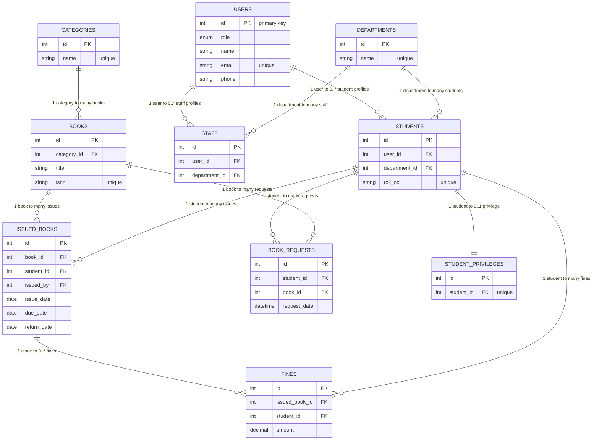

# ER Diagram (Mermaid)

The following diagram was generated from the project's migrations. It includes primary keys, important columns, foreign keys, and cardinalities as enforced by the migrations.

File: [docs/ER_diagram.mmd](docs/ER_diagram.mmd)
