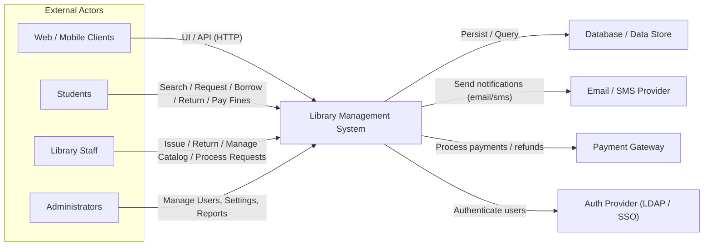

# Context Level (Level 0) Diagram

This Level-0 context diagram shows the `Library Management System` boundary and external actors/systems that interact with it.

File: [docs/context_level_diagram.mmd](docs/context_level_diagram.mmd)
