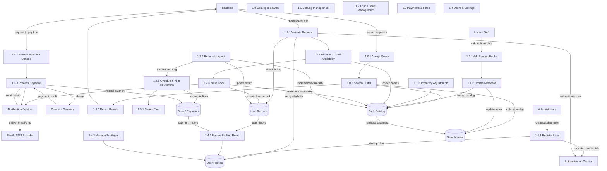

# Logical DFD — Complete

This document contains the full logical Data Flow Diagram for the Library Management System. It shows logical processes, data stores, external actors, authentication and notification flows, and inter-process data movement.

File: [docs/logical_dfd.mmd](docs/logical_dfd.mmd)
